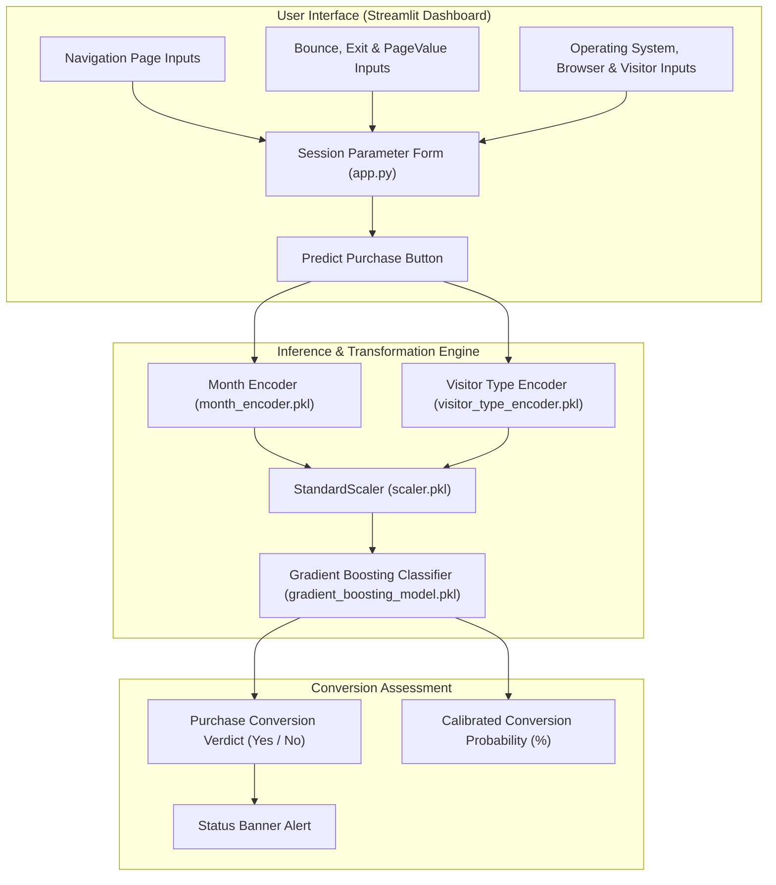

<br/><br/>

<!-- Animated Title -->
<p align="center">
  <a href="#">
    
  </a>
</p>

<p align="center">
  <b>Production-Grade Machine Learning Pipeline for Real-Time E-Commerce Session Conversion & Purchase Propensity Forecasting</b><br/>
  <i>Gradient Boosting Classifier · 17-Dimensional Session Telemetry · PageValues & Bounce Dynamics · Real-Time Streamlit Diagnostic Studio</i>
</p>

<br/>

<!-- Badges Row 1: Core Technologies -->
<p align="center">
  
  
  
  
  
</p>

<!-- Badges Row 2: Standards & Status -->
<p align="center">
  
  
  
  
</p>

<br/>

<!-- Quick Navigation Bar -->
<p align="center">
  <a href="#-overview"></a>
  &nbsp;
  <a href="#-problem-statement--e-commerce-solution"></a>
  &nbsp;
  <a href="#-session-telemetry-features"></a>
  &nbsp;
  <a href="#%EF%B8%8F-system-architecture"></a>
  &nbsp;
  <a href="#-machine-learning-pipeline"></a>
  &nbsp;
  <a href="#-quickstart--execution"></a>
</p>

---

## 📌 Overview

**Online Shoppers Purchase Intention Prediction** is a machine learning system engineered to predict whether a browsing web visitor will complete a transaction (`Revenue = True`) or abandon their cart before checkout.

Trained on the **UCI Online Shoppers Purchasing Intention Dataset** (representing over 12,000 unique user sessions), the platform extracts **17 distinct behavioral and technical telemetry features**—including page visit counts, browsing durations, Google Analytics metrics (`BounceRates`, `ExitRates`, `PageValues`), calendar seasonality, and visitor classification.

Powered by a calibrated **Gradient Boosting Classifier** (`gradient_boosting_model.pkl`), the system provides digital marketers and e-commerce platforms with real-time conversion probability scores, unlocking dynamic checkout incentives, proactive chat triggers, and personalized cart-abandonment prevention.

```
                      ┌────────────────────────────────────────────────────────┐
                      │              Shopper Conversion Engine                 │
                      │                                                        │
[ Live Web Session:  ]┼──> [ Label Encoding & Scaler Pipeline ]                ├──> [ Conversion Propensity ]
[ Pages, Rates, Time ]│             │                                          │    - Purchase Verdict (Yes/No)
                      │             ▼                                          │    - Conversion Probability (%)
                      │    [ Gradient Boosting Classifier ]                    │    - Revenue Potential Tier
                      │             │                                          │    - Dynamic Cart Intervention
                      │             ▼                                          │
                      │    [ Sigmoid Probability Score ] ──> Threshold Check   │
                      └────────────────────────────────────────────────────────┘
```

---

## 🎯 Problem Statement & E-Commerce Solution

<table>
<tr>
<td width="50%" valign="top">

### ❌ The Cart Abandonment Bottleneck

E-commerce businesses struggle with high acquisition costs and low on-site conversion:

- 🛒 **$\approx 70\%$ Cart Abandonment**: The vast majority of browsing sessions end without generating revenue.
- 💸 **Inefficient Discount Blasting**: Offering exit-intent discounts to users who were already planning to buy erodes profit margins.
- ⏳ **Ephemeral Window of Opportunity**: Purchase intent shifts within seconds based on page engagement and load times.
- 📉 **High Web Traffic Volatility**: Weekend vs. weekday patterns, holiday proximity, and returning versus new visitors demand continuous calibration.

</td>
<td width="50%" valign="top">

### ✅ The Predictive ML Solution

| Challenge | Applied Engineering Solution |
| :--- | :--- |
| **Real-Time Scoring** | **Gradient Boosting** models complex non-linear combinations between `PageValues` and `ExitRates` in $<3\text{ms}$. |
| **Google Analytics Integration** | Native ingestion of **Bounce Rates**, **Exit Rates**, and proprietary **Page Values**. |
| **Scalable Pipeline Artifacts** | Encapsulated with dedicated **StandardScaler** and **LabelEncoders** for zero-drift inference. |
| **Interactive Studio** | **Streamlit** dashboard enabling merchandising teams to simulate session combinations and test thresholds. |

</td>
</tr>
</table>

---

## 🔥 Session Telemetry Features

<table>
<tr>
<td width="33%" align="center" valign="top">

### 📄 Page Browsing
<br/>
<b>Navigation Behavior</b>
<p align="left">
• Administrative page hits & duration<br/>
• Informational research page visits<br/>
• ProductRelated item browsing depth<br/>
• Total cumulative session dwell time
</p>

</td>
<td width="33%" align="center" valign="top">

### 📊 Engagement Analytics
<br/>
<b>Google Analytics Metrics</b>
<p align="left">
• BounceRates (% immediate departures)<br/>
• ExitRates (% of exits from page)<br/>
• PageValues (historical revenue score)<br/>
• SpecialDay proximity (Mother's Day, etc.)
</p>

</td>
<td width="33%" align="center" valign="top">

### 🌐 User Context
<br/>
<b>Environment & Visitor Type</b>
<p align="left">
• Operating system & browser type<br/>
• Geographic regional origin<br/>
• Direct vs referral TrafficType<br/>
• Returning vs New Visitor classification<br/>
• Weekend vs Weekday flag
</p>

</td>
</tr>
</table>

---

## 🏗️ System Architecture



---

## ⚙️ Technical Stack

| Component | Technology | Purpose & Implementation |
| :--- | :--- | :--- |
| **Model Framework** | **Scikit-Learn GradientBoostingClassifier** | Ensembles of decision trees minimizing log-loss |
| **Preprocessing** | **StandardScaler & LabelEncoder** | Numerical standardization and categorical encoding |
| **Interactive UI** | **Streamlit** | Multi-column real-time session testing portal |
| **Data Processing** | **Pandas & NumPy** | Array conversion and dataframe manipulation |
| **Model Serialization** | **Joblib** | Serialized model, scaler, and encoder persistence |
| **Dataset Source** | **UCI Machine Learning Repository** | Online Shoppers Purchasing Intention Dataset |

---

## 📁 Repository Structure

```
Online-Shoppers-Purchase-Intention-Prediction/
├── 📄 app.py                                   # Streamlit prediction web application
├── 📄 Online_Shoppers'_Intention_Prediction.ipynb # Model training & EDA notebook
├── 📄 gradient_boosting_model.pkl              # Serialized Gradient Boosting model
├── 📄 scaler.pkl                               # Serialized StandardScaler for numerical metrics
├── 📄 month_encoder.pkl                        # Serialized categorical month encoder
├── 📄 visitor_type_encoder.pkl                 # Serialized visitor type encoder
├── 📊 online_shoppers_intention.csv            # Training & evaluation dataset (12.3K sessions)
├── 📄 requirements.txt                         # Dependencies
└── 📄 README.md                                # Documentation
```

---

## 🚀 Quickstart & Execution

### Prerequisites
- **Python**: 3.10 or higher
- **Virtual Environment**: Recommended

---

### 1. Installation

```bash
# 1. Clone repository
git clone https://github.com/IbrahimAbdelsattar/Online-Shoppers-Purchase-Intention-Prediction.git
cd Online-Shoppers-Purchase-Intention-Prediction

# 2. Create virtual environment
python -m venv venv
source venv/bin/activate        # On Windows: .\venv\Scripts\activate

# 3. Install dependencies
pip install -r requirements.txt
pip install streamlit scikit-learn pandas numpy joblib
```

---

### 2. Running the Shopper Prediction Dashboard

```bash
streamlit run app.py
```

*The interface will automatically launch at `http://localhost:8501`.*

---

## 👥 Author & Connect

**Ibrahim Abdelsattar**  
*AI Engineer & Machine Learning Specialist*

- 🌐 **GitHub**: [@IbrahimAbdelsattar](https://github.com/IbrahimAbdelsattar)
- 💼 **LinkedIn**: [Ibrahim Abdelsattar](https://www.linkedin.com/in/ibrahim-abdelsattar/)
- 📧 **Email**: [ibrahimabdelsattar042@gmail.com](mailto:ibrahimabdelsattar042@gmail.com)

---

<p align="center">
  <sub>Engineered for e-commerce analytics, conversion optimization, and session intelligence. © 2026 Online Shopper Prediction.</sub>
</p>
